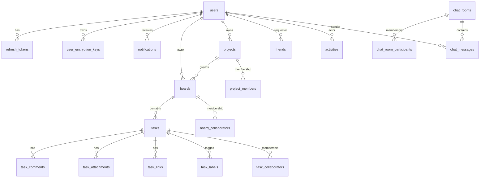

# ER Diagram (Mermaid)

> Source-of-truth snapshot for documentation purposes.
> Keep this file aligned with the current relational schema.

## Notes

- `jwt_keys` is infrastructure persistence and intentionally isolated from business aggregates.
- Join tables (`*_members`, `*_collaborators`, `chat_room_participants`) use composite keys for uniqueness.
